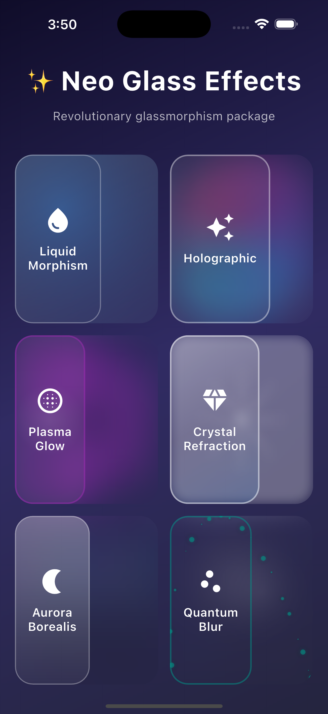
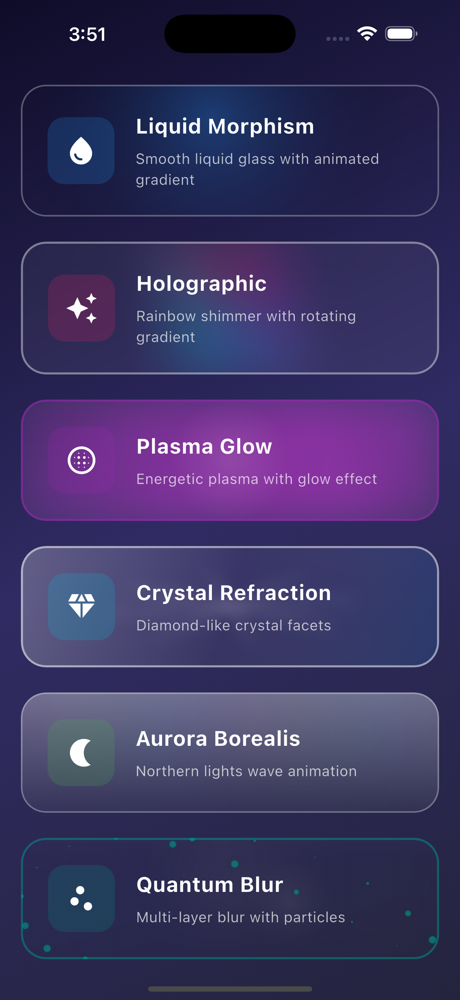

# Neo Glass 🌟

A revolutionary Flutter package featuring 6 unique glassmorphism effects that don't exist in any other package.

[](https://pub.dev/packages/neo_glass)
[](https://opensource.org/licenses/MIT)

## ✨ Features

- 💧 **Liquid Morphism** - Animated liquid gradient flowing through glass
- 🌈 **Holographic** - Rainbow shimmer effect with rotating gradient
- ⚡ **Plasma Glow** - Energetic plasma balls with outer glow
- 💎 **Crystal Refraction** - Diamond-like crystal facets with light refraction
- 🌌 **Aurora Borealis** - Northern lights wave animation
- ⚛️ **Quantum Blur** - Multi-layer blur with floating particles

## 🚀 Installation

Add this to your package's `pubspec.yaml` file:
```yaml
dependencies:
  neo_glass: ^1.0.1+2
```

Then run:
```bash
flutter pub get
```

## 🎨 All Effects Demo

### Liquid Morphism
```dart
NeoGlassContainer(
  effect: NeoGlassEffect.morphism,
  accentColor: Colors.blue,
  child: YourWidget(),
)
```

### Holographic
```dart
NeoGlassContainer(
  effect: NeoGlassEffect.holographic,
  customColors: [Colors.pink, Colors.purple, Colors.blue, Colors.cyan],
  child: YourWidget(),
)
```

### Plasma Glow
```dart
NeoGlassContainer(
  effect: NeoGlassEffect.plasma,
  accentColor: Colors.purple,
  intensity: 1.5,
  child: YourWidget(),
)
```

### Crystal Refraction
```dart
NeoGlassContainer(
  effect: NeoGlassEffect.crystal,
  intensity: 1.2,
  child: YourWidget(),
)
```

### Aurora Borealis
```dart
NeoGlassContainer(
  effect: NeoGlassEffect.aurora,
  customColors: [Colors.green, Colors.blue, Colors.purple],
  child: YourWidget(),
)
```

### Quantum Blur
```dart
NeoGlassContainer(
  effect: NeoGlassEffect.quantum,
  accentColor: Colors.cyan,
  child: YourWidget(),
)
```

## 📸 Visual Preview

### All 6 Glass Effects


### Detailed Effect Overview



## 🎯 Properties

| Property | Type | Default | Description |
|----------|------|---------|-------------|
| `effect` | `NeoGlassEffect` | `morphism` | Type of glass effect |
| `width` | `double?` | `null` | Container width |
| `height` | `double?` | `null` | Container height |
| `intensity` | `double` | `1.0` | Effect intensity (0.5 - 2.0) |
| `accentColor` | `Color?` | `null` | Primary accent color |
| `customColors` | `List<Color>?` | `null` | Custom color palette |
| `borderRadius` | `double` | `24.0` | Corner radius |
| `padding` | `EdgeInsets?` | `null` | Internal padding |
| `margin` | `EdgeInsets?` | `null` | External margin |
| `animate` | `bool` | `true` | Enable/disable animation |
| `animationDuration` | `Duration` | `3 seconds` | Animation cycle duration |

## 💡 Tips

- Use `intensity` between 0.8-1.5 for best results
- Plasma and Quantum effects work best on dark backgrounds
- Holographic effect looks stunning with custom rainbow colors
- Disable animation (`animate: false`) to improve performance if needed

## 🤝 Contributing

Contributions, issues, and feature requests are welcome!

## 📄 License

This project is [MIT](LICENSE) licensed.

🙏 Support
If you like this package, give it a ⭐ on GitHub!

Made with ❤️ by [@smtechviral](https://github.com/smtechviral)